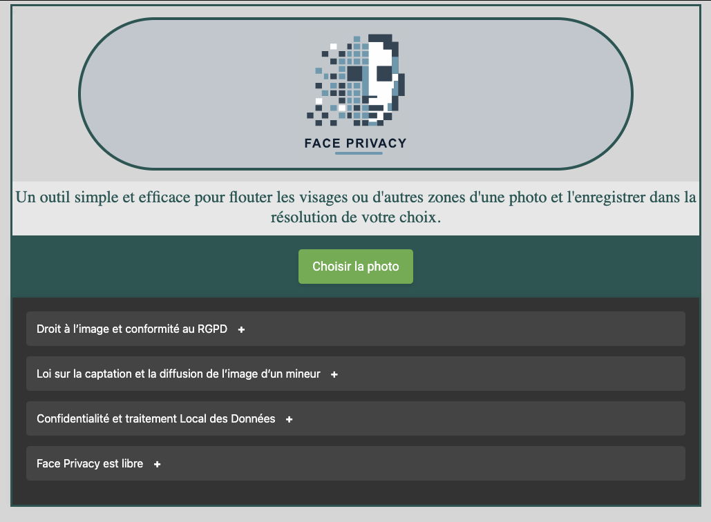

<!--
NB: Deze README is automatisch gegenereerd door <https://github.com/YunoHost/apps/tree/master/tools/readme_generator>
Hij mag NIET handmatig aangepast worden.
-->

# FacePrivacy voor Yunohost

[](https://ci-apps.yunohost.org/ci/apps/faceprivacy/)


[](https://install-app.yunohost.org/?app=faceprivacy)

*[Deze README in een andere taal lezen.](./ALL_README.md)*

> *Met dit pakket kun je FacePrivacy snel en eenvoudig op een YunoHost-server installeren.*  
> *Als je nog geen YunoHost hebt, lees dan [de installatiehandleiding](https://yunohost.org/install), om te zien hoe je 'm installeert.*

## Overzicht

Face Privacy is a web application that makes it easy to blur faces and specific areas on photos, all entirely within the browser. It guarantees data confidentiality by processing all operations locally on the user's device, without downloading photos to external servers.

### Features

- Face blur
- Blurring of customised areas
- Completely local processing
- Export in different resolutions 
- Intuitive interface


**Geleverde versie:** 2025.03.13~ynh1

**Demo:** <https://faceprivacy.forge.apps.education.fr/app/>

## Schermafdrukken



## Documentatie en bronnen

- Officiele website van de app: <https://faceprivacy.forge.apps.education.fr/app/>
- Upstream app codedepot: <https://forge.apps.education.fr/faceprivacy/app>
- YunoHost-store: <https://apps.yunohost.org/app/faceprivacy>
- Meld een bug: <https://github.com/YunoHost-Apps/faceprivacy_ynh/issues>

## Ontwikkelaarsinformatie

Stuur je pull request alsjeblieft naar de [`testing`-branch](https://github.com/YunoHost-Apps/faceprivacy_ynh/tree/testing).

Om de `testing`-branch uit te proberen, ga als volgt te werk:

```bash
sudo yunohost app install https://github.com/YunoHost-Apps/faceprivacy_ynh/tree/testing --debug
of
sudo yunohost app upgrade faceprivacy -u https://github.com/YunoHost-Apps/faceprivacy_ynh/tree/testing --debug
```

**Verdere informatie over app-packaging:** <https://yunohost.org/packaging_apps>
